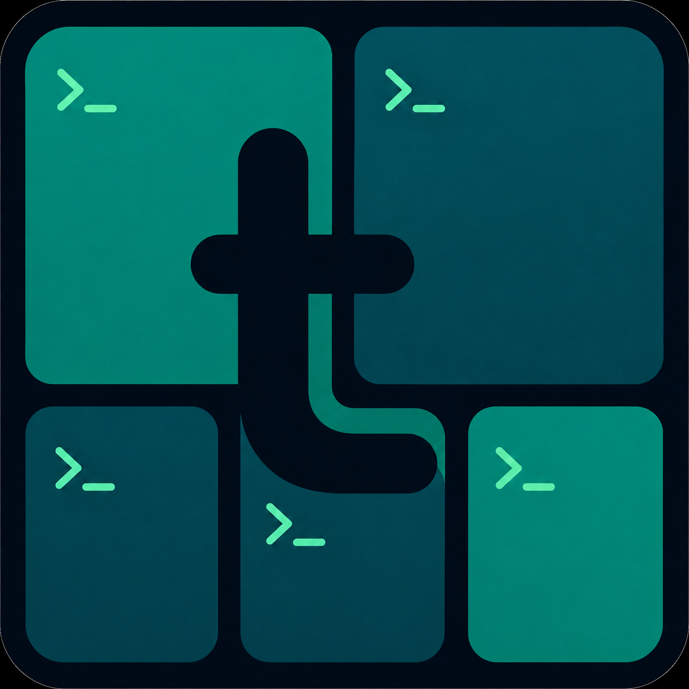

<p align="center">
  
</p>

<h1 align="center">letee</h1>

<p align="center">
  Letee, pronounced luh-tee.<br>
  Every tmux session. Every coding agent. Local or remote. In one place.
</p>

`letee` is a tmux cockpit that allows to run many sessions and coding agents. It adds a persistent sidebar to your existing terminal, bringing local and SSH work into one unified focused view.

Your sessions remain ordinary tmux sessions. Keep your terminal, tmux configuration, keybindings, plugins, and workflows. `letee` only makes them easier to see and reach.

## Why letee?

- **Keep your setup**: letee builds on tmux instead of replacing it. No new terminal app. No replacement tmux setup. No retraining your muscle memory.
- **See everything in one place**: local and remote sessions and their agents share one sidebar.
- **Know what needs you**: live agent states, agent alerts, and tmux bells surface work that needs attention.
- **Jump straight to the work**: select a session or go directly to an agent's exact tmux window and pane.
- **Manage sessions without breaking focus**: find, create, track, rename, reorder, remove, kill, or recreate sessions with the keyboard or mouse.

## Quick start

Requires Python 3.11+, tmux, and OpenSSH. Automatic discovery for Claude Code, Codex, Pi, and OpenCode is optional and requires [agent-status](https://github.com/julsemaan/agent-status) wherever those agents run. `pip install letee` also installs the `agent-status` Python package. Remote machines without letee still need `agent-status` installed separately when agents run there.

```sh
pip install letee
letee
```

That opens an outer tmux workspace with the sidebar on the left and your selected session on the right. Press `C-s s` for Sessions, `C-s a` for Agents, or `C-s +` to add a session. Press `Enter` to open the selected session or jump to the selected agent's exact pane.

Run independent cockpits with named outer tmux servers:

```sh
letee -L work
letee -L personal
letee list-servers
letee -L work kill-server
```

## How it works

`letee` creates or attaches to a dedicated outer tmux server. That outer layer owns only the layout. Bare `letee` uses default server; `-L NAME` uses `letee-NAME`. Reopening same name uses `attach -d`, moving cockpit to newest terminal.

- outer prefix: `C-s`
- focus/open Sessions: `C-s s`
- add session: `C-s +`
- focus/open Agents: `C-s a`
- remove active session from letee: `C-s r`
- kill and remove active session: `C-s x` (confirmation required)
- jump to first alerted agent: `C-s !`
- focus active session: `C-s w`
- hide/show sidebar: `C-s h`
- quit cockpit: `C-s q`
- show help: `C-s ?`
- detach letee: `C-s d`
- forward outer prefix to inner session: `C-s C-s`
- standard outer tmux prefix bindings: disabled
- outer status: off
- left pane: `letee` sidebar, 40 columns by default
- right pane: selected local/remote tmux attach client

`C-s h` zooms the right pane instead of killing the sidebar. Sidebar process stays alive while hidden, preserving selection, polling, and alerts. `C-s a`, `C-s s`, and `C-s +` restore visible layout while focusing Agents, focusing Sessions, or opening Add session menu.

Inner local and remote sessions keep their normal tmux prefix and bindings, and remain alive when you switch away. Only letee's outer `prefix` key table is restricted.

## Configuration

Files live in `~/.config/letee/`:

```toml
hosts = ["my-remote-machine"]
prefix = "C-s"
sidebar_width = 40
status_timeout = 5
agent_panel_resize_step = 5
persistent_ssh = true
```

### Prefix

`prefix` accepts one non-empty, printable tmux key token without whitespace. `sidebar_width` sets left pane width in columns. `status_timeout` controls how many seconds sidebar feedback remains visible. `agent_panel_resize_step` sets percentage points per `[` or `]` press and must be an integer from 1 through 100. Default step gives `40% → 45% → 50%`. Adjustment lasts for current sidebar process; rerun `letee` after changing configuration.

`C-s` normally sends XOFF when terminal `IXON` flow control is enabled. Attached tmux disables flow control on outer tty, so outer prefix works without global `stty` changes. Readline, Emacs, or Vim `C-s` commands require `C-s C-s` to forward literal `C-s`; inner tty may still treat it as XOFF, in which case `C-q` resumes output.

To restore old prefix, set `prefix = "C-g"` and rerun `letee`.

### Remote hosts

Hosts are SSH aliases only. Keep host-specific users, ports, keys, proxies, IPv6, and other connection settings in `~/.ssh/config`.

By default, letee makes OpenSSH reuse one authenticated transport per host with `ControlMaster=auto`, `ControlPersist=10m`, and `ControlPath=~/.ssh/letee-%C`. Later discovery polls, switches, creates, and kills avoid repeating TCP setup, key exchange, and authentication. Control sockets remain for 10 minutes after last use.

Interactive startup blocks before opening cockpit while it groups hosts by effective `IdentityAgent`, or by `IdentityFile` when no agent applies. It warms one host from each group sequentially, trying next group host after a warm-up failure, then probes remaining hosts together without sharing the terminal. Failed probes retry through sequential interactive SSH checks, so enter passphrases when OpenSSH asks; hosts that still fail remain unavailable, and diagnostics suggest running `ssh <host>` directly. Preflight disables multiplexing, so an existing control connection cannot bypass authentication. Non-TTY startup skips these SSH checks and reports why. No configured hosts means no SSH setup output.

Letee reuses reachable inherited `SSH_AUTH_SOCK`. When none is usable, it starts or reuses persistent fallback agent socket `~/.ssh/letee-agent.sock`; its unlocked keys survive later letee launches while agent stays alive. Shared SSH options include `AddKeysToAgent=yes`, so successfully used file-backed keys are cached in agent. Hardware-backed keys and keys requiring confirmation can still prompt for each use; grouping reduces concurrent prompts but cannot override token or agent confirmation policy.

Every letee SSH connection also uses `ServerAliveInterval=60` and `ServerAliveCountMax=3` to detect dead connections and keep idle sessions active through network and NAT timeouts. Keepalive remains enabled when `persistent_ssh` is disabled.

To omit letee's persistence options, set:

```toml
persistent_ssh = false
```

SSH config still applies, so this opt-out does not disable multiplexing configured there.

Names of the hosts must match:

```text
[A-Za-z0-9_.-]{1,64}
```

## CLI commands

```sh
letee list
letee list-servers
letee switch local:<session>
letee switch ssh:<host>:<session>
letee switch-session <1-9>
letee create local <session>
letee create ssh <host> <session>
letee kill local:<session>
letee kill ssh:<host>:<session>
letee rename local:<old-session> <new-session>
letee rename ssh:<host>:<old-session> <new-session>
letee -L <name> kill-server
```

`-L <name>` applies to cockpit, tracked-session commands, and `kill-server`; `list-servers` discovers running verified letee servers only. `rename` requires tracked targets and updates only selected server after tmux rename succeeds. Switching uses outer tmux `respawn-pane` on right pane. Real tmux sessions stay alive.

## Sidebar keys

- `C-s s`: show sidebar and focus Sessions; recreates sidebar if quit
- `C-s +`: show sidebar and open Add session menu; recreates sidebar if quit
- `C-s a`: show sidebar and focus Agents; recreates sidebar if quit
- `C-s r`: remove active right-pane session from letee without killing tmux session
- `C-s x`: kill and remove active right-pane session after `y/N` confirmation
- `x` while Agents is focused: terminate selected agent foreground job with `SIGTERM` after confirmation; pane and shell survive
- `C-s !`: show Agents and jump to first alerted agent; no alert leaves right pane focused
- `C-s w`: focus right pane
- `C-s h`: hide/show sidebar; sidebar remains alive while hidden
- `C-s q`: quit outer letee
- `C-s ?`: show help in right pane
- `C-s d`: detach outer letee
- `C-s C-s`: forward `C-s` to inner session
- `C-s 1`–`C-s 9`: switch directly to numbered tracked target
- `j` / `k` or arrows: move selection pointer (`›`) in focused region
- `[` / `]`: increase/decrease Agents share by configured percentage points for current run
- `Left` / `Right`: cycle agent ordering mode (Priority / Session) when ordering row is selected
- `Enter`: switch selected session or exact agent pane, or activate selected Add row
- `e`: rename selected available tracked session
- `r`: remove selected target without killing it
- `K` / `J`: move selected tracked target up/down without wrapping
- `x`: kill and remove selected tracked session (asks first)
- `Esc` / `Ctrl-C`: cancel prompts and filters

`›` marks keyboard selection and left-pane focus; mint reverse highlight marks active session independently. Unfocused sidebar hides pointer while preserving selection, viewport, colors, and active-session highlight.

Normal sidebar lists sessions in persisted manual order. Add menu separates `New session` from `Existing session`. New-session flow skips location selection when exactly one local/SSH location is available; multiple locations use dedicated picker, then dedicated name input. Existing-session search lists only untracked sessions. Selecting or creating one persists it and switches immediately. Independently navigable Agents region remains visible below `AGENTS` divider when Add menu is closed. Priority mode puts alerts first, then status priority, recent idle transitions, tracked session order, numeric window/pane, and agent ID; Session mode uses tracked session order, numeric window/pane, and agent ID. First nine sessions receive shortcut numbers; `K`/`J` updates order. Missing sessions remain launchers: `Enter` uses tmux `new-session -A` to recreate and attach. Tracked sessions persist in `~/.config/letee/sessions` for default server and `~/.config/letee/servers/<name>/sessions` for named servers. Config, hosts, prefix, dimensions, timeout, and SSH settings stay shared. Tracked sessions, ordering, active target, alerts, and cockpit panes stay isolated. `kill-server` removes only selected outer cockpit; tracked inner tmux sessions and persisted state survive. Same inner session may be tracked by multiple servers, so overlapping servers can show duplicate alerts. Prefix session actions use active right-pane target, never sidebar selection; missing or untracked targets show status and do nothing. `prefix+!` follows current Agents order, jumps to exact window/pane, and clears only selected alert after success. No alert shows `no agent alerts` in Agents and leaves right pane focused. Set `LETEE_ASCII=1` for text-only labels and ellipses.

## Agent discovery

Letee discovers coding agents by reading [agent-status](https://github.com/julsemaan/agent-status) JSON status files. The agent-status plugin for your coding agent is **required** for detection — install it in each agent you want letee to discover. See the [agent-status documentation](https://github.com/julsemaan/agent-status) for full setup instructions and configuration.

### Getting started with coding agents

Agent discovery requires the agent-status plugin for your coding agent. The plugin emits JSON status files that letee reads to show agent state in the sidebar.

#### Claude Code

Requires Python 3.10+ and Linux or macOS.

```bash
claude plugin marketplace add julsemaan/agent-status
claude plugin install agent-status@agent-status
```

Start or restart Claude Code. The plugin uses hooks only—no model tools or MCP server—and emits 20-second heartbeats while the session runs.

#### Codex (OpenAI Codex CLI)

```bash
codex plugin marketplace add julsemaan/agent-status
codex plugin add agent-status@agent-status
```

Start Codex in any repo, open `/hooks`, and trust the agent-status hooks. First prompt starts a detached sidecar that emits 20-second heartbeats.

#### Pi (pi-coding-agent)

```bash
pi install git:github.com/julsemaan/agent-status@v0.1.26
```

Then run `/reload` or restart pi.

#### OpenCode

Add the agent-status plugin to `opencode.json`:

```json
{
  "$schema": "https://opencode.ai/config.json",
  "plugin": ["agent-status-opencode"]
}
```

Then start or restart OpenCode. OpenCode installs the plugin from npm automatically.

Run `letee` — agents appear automatically in the Agents sidebar (`C-s a`).

### How agent discovery works

Agent records are read from `$AGENT_STATUS_DIR`, `$XDG_STATE_HOME/agent-status`, or `~/.local/state/agent-status`, in that order. Local and remote running agents updated within 60 seconds are correlated by exact tmux socket and pane ID. Selecting agent navigates to exact server, window, and pane; active agent name and location remain orange independently of keyboard selection. Working agents show `for <duration>`; other states show no duration. Working durations prefer `task.status_timestamp` and fall back to `runtime.updated_at`; unusable optional timestamps omit duration. Each agent row starts with a semantic status icon; working agents use an animated Braille spinner. Focused selection replaces that icon with `›`, and moving focus away restores it. Status icon and text share semantic color; selection cursor stays orange. `LETEE_ASCII=1` uses ASCII icons, spinner frames, and `>` cursor. Attention states remain bold and idle/canceled remain dim without color. Agent second lines show `<session> · <window name>`; host stays available for targeting but is not rendered. Agents are discovered automatically, but only agents in tracked sessions appear. Agents cannot be added, removed, or reordered as favorites.

### Terminating agents

Press `x` with Agents focused to terminate selected local or remote agent. Letee queries exact tmux socket and pane, sends `SIGTERM` to foreground process group, and leaves pane and interactive shell alive. Idle panes are protected: when foreground group is pane shell's group, letee refuses action instead of terminating shell.

### Agent alerts

When a tracked agent changes from `working` to `idle`, `completed`, `input-required`, `auth-required`, `failed`, `rejected`, or `canceled`, sidebar beeps once and marks that exact pane/agent with `🔔` (`BELL` in ASCII mode). Initial discovery does not alert. Marker survives later state changes until exact pane opens, is already active during discovery, disappears from discovery, or sidebar restarts.

## Mouse controls

- left-button press on session or agent row: select and switch immediately; release and incidental movement do nothing
- right-click tracked session: open native tmux menu to rename, remove, or kill it with confirmation; right-click does not switch sessions
- click tracked session's `↕` handle (`:` in ASCII mode), hover destination, then click destination row to move; source and insertion target highlight while moving
- `Esc`, background click, or repeated source-handle click cancels move; hovering `↑ more` or `↓ more` auto-scrolls
- right-click agent: open native tmux `Kill` menu; confirmation sends `SIGTERM` to foreground process group while pane and shell survive; right-click does not switch session or agent pane
- click `＋ add`, Add choice, or available location row: activate same flow as `Enter`
- click `‹ back` (`< back` in ASCII mode) in Add-session top bar: go back one level, same as `Esc`
- wheel over Sessions or Agents: scroll the region under the pointer without keyboard focus or changing selection
- right-pane mouse events: forwarded by outer tmux to mouse-aware applications
- live border dragging: disabled so text selection can cross the sidebar divider without resizing it

Tmux mouse capture may require holding `Shift` for terminal-native text selection.

## Debug logging

Set `LETEE_DEBUG_LOG` to a file path to write opt-in JSONL diagnostics. Logging is off when the variable is unset.

```sh
letee kill-server
LETEE_DEBUG_LOG="$HOME/.local/state/letee/click-debug.jsonl" letee
```

For a named server:

```sh
letee -L work kill-server
LETEE_DEBUG_LOG="$HOME/.local/state/letee/work-click-debug.jsonl" letee -L work
```

The startup record and any ncurses mouse decode failure include the relevant tmux and terminal mouse state. After reproducing the missed click, stop or detach letee and preserve the log.

## Clipboard

Native tmux copy mode forwards copied text through nested sessions using OSC 52. Physical terminal must support and enable OSC 52 clipboard access. letee declares inner clients as `clipboard` capable and sets outer server option `set-clipboard on`; inner tmux configuration remains unchanged, including explicit `set-clipboard off`.

**Security:** `set-clipboard on` permits processes in local and remote panes to set system clipboard through OSC 52. Only connect to trusted hosts and run trusted pane processes.

For development and testing instructions, see the [development guide](DEVELOPMENT.md).

### Preparing a release

Use GitHub UI to create release PR:

1. Open **Actions → Prepare release**.
2. Select `main` as workflow branch and click **Run workflow**.
3. Leave **Version** blank for next patch version, or enter explicit `MAJOR.MINOR.PATCH` version.
4. Click **Run workflow**.

Workflow creates `release/v<version>`, commits `pyproject.toml` and `letee/__init__.py`, pushes branch, and opens PR to `main`.

Enable **Settings → Actions → General → Allow GitHub Actions to create and approve pull requests** so workflow can open PRs with built-in `GITHUB_TOKEN`.

Merging release PR starts build, PyPI publication, and GitHub release automatically.

## License

Licensed under the [Apache License 2.0](LICENSE).

